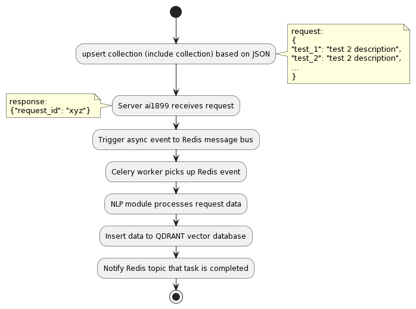
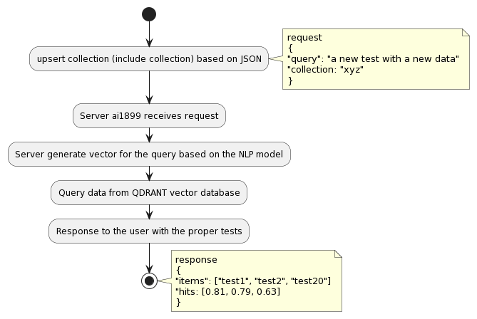
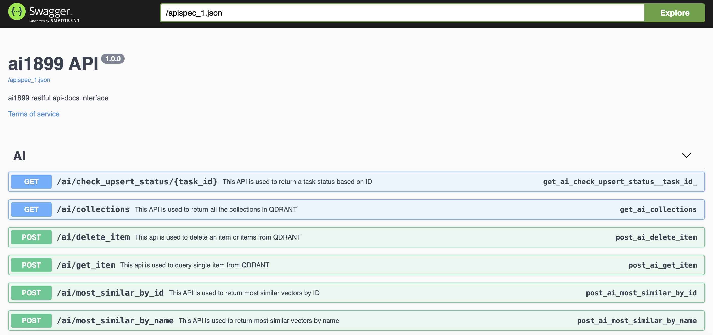

------

[](https://opensource.org/license/mit)

What?
------
ai1899 is a project designed for anyone seeking to utilize humanized queries for selecting test cases efficiently.
Leveraging Sentence Transformers, Flask, and QDRANT, this project facilitates the creation of vectors from test case descriptions.
Consequently, users can query the system via Flask APIs to retrieve test cases that match specific criteria.

The project employs models that can be selected and downloaded offline from Hugging Face's repository: https://huggingface.co.
During development, the primary model utilized was msmarco-distilbert-base-tas-b, accessible here: https://huggingface.co/sentence-transformers/msmarco-distilbert-base-tas-b

Call flow:
----------
Adding the tests called "upsert", this is the call flow describing it:



The query flow is as the following:



How to run?
----------
To enhance performance and minimize footprint,
the recommended approach is to load the model onto a shared volume using download_model.py, however,
You can use upsert api to ingest the vectors.

To initiate the stack, execute the following command:
-----------------------------------------------------
```DEVICE=/path/to/downloaded/model LM_MODEL=model-name docker compose -f docker-compose.yaml up -d```

another option for debug could be taking the base of the docker-compose and appending the debug (attached as reference)

```DEVICE=/path/to/downloaded/model LM_MODEL=model-name docker compose -f docker-compose.yaml -f docker-compose-debug.yaml up -d```

RestAPI:
-------
When you'll start the stack, you would be able to connect using both restful client (such as Postman),
or if should you choose, use Swagger based rest calls.

The address is http://{stackaddress}/apidocs



Integration:
------------
To accelerate the adoption of ai1899, a plugin made for pytest was created.
The url for the plugin is: https://github.com/Formartha/pytest-ai1899/tree/main

The plugin allows a system to decide a query term, configure the ai1899 stack location,
limit the amount of responses back and deselect tests (skip) which dosn't meet the query criteria.

Example for creating the collection to query from:
---------------------------------------------------
An example of creating a collection can be found <a href="ai1899/examples/collection_a_example.json">here</a>
In the example, you will find a dictonary with ```{"test_name": "and the test description"}```, this will allow generating a proper vector based on the NLP model which is being used in the AI stack.

By uploading this collection and giving it the name ```Tests1```, you will be able to upload it to ai1899 using either swagger or via direct call:

```
import requests

url = "http://127.0.0.1/ai/upsert_collection"

payload = {'collection': 'Tests1'}
files=[
  ('file',('collection_a_example.json',open('collection_a_example.json','rb'),'application/json'))
]
headers = {}

response = requests.request("POST", url, headers=headers, data=payload, files=files)

print(response.text)
```

After the upload, the ai1899 will return an ID which will be usable to trace the status of creating vectors and pushing it to QDRANT. Note: this process might take time as it's being running as an async call and handled by the celery worker which will ingest the data using the same model which was used to start the ai1899 stack.

FAQ:
----
**Question:**

What size models did you test this on? What are the minimum hardware requirements?

**Answer:**

The model tested is not particularly relevant (broadly speaking) since all it does is generate vectors - there is no training involved as the goal is ultimately to find the cosine similarity.

The hardware requirements were not specifically tested - you can examine them yourself, but broadly speaking what is currently shown in the docker-compose file represents the minimum needed to run the stack.

while develiping the project, the distilbert-base-uncased was used, which worked well enough to test the use case and build the infrastructure. Since the platform is flexible enough, you can load whichever model you want (not at runtime, but at deploy time) and use it.


**Question:**

What is the main difference between storing the data in Elastic or a similar database? Is it the ability to use natural language?

**Answer:**

Broadly speaking, the model generates a vector based on each of the input strings (according to the tokenizer).

This vector needs to be stored somewhere, in this case it is stored in a Vector Database called QDRANT (not Elastic).

At query time to the AI, the query goes through the same vector generation process and using the QDRANT client, it retrieves the relevant information from it. Depending on the implementation, n possible matches are returned, with the ability to limit the number of responses (currently set to 5).
So if you have a catalog of 5,000 tests, each with a description, you can use a natural language query to get the tests most similar to what you want to check, in descending order of relevance.

Additionally, the model's accuracy (hits) is returned, allowing you to assess whether the chosen model is suitable for use and whether there is a need to improve the test descriptions.
The main difference compared to using a traditional database like Elastic is the ability to query based on semantic similarity using natural language, rather than just lexical matching of keywords.

Troubleshoot
------------
There is a known issue to install docker-compose on Mx processors (Mac), to fix it you should.
1. pip3 install "cython<3.0.0" wheel && pip3 install pyyaml==5.4.1 --no-build-isolation
2. pip3 install docker-compose
