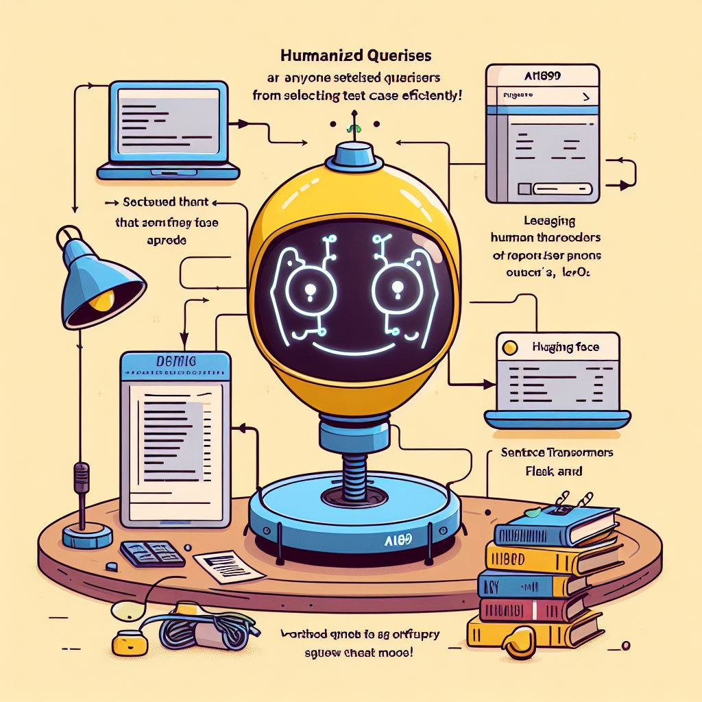

What?
------
ai1899 is a project designed for anyone seeking to utilize humanized queries for selecting test cases efficiently.
Leveraging Sentence Transformers, Flask, and QDRANT, this project facilitates the creation of vectors from test case descriptions.
Consequently, users can query the system via Flask APIs to retrieve test cases that match specific criteria.

The project employs models that can be selected and downloaded offline from Hugging Face's repository: https://huggingface.co.
During development, the primary model utilized was msmarco-distilbert-base-tas-b, accessible here: https://huggingface.co/sentence-transformers/msmarco-distilbert-base-tas-b

How to run?
----------
To enhance performance and minimize footprint,
the recommended approach is to load the model onto a shared volume using download_model.py, however,
You can use upsert api to ingest the vectors.

To initiate the stack, execute the following command:
-----------------------------------------------------
DEVICE=/path/to/downloaded/model LM_MODEL=model-name docker compose up -d

Troubleshoot
------------
There is a known issue to install docker-compose on Mx processors (Mac), to fix it you should.
1. pip3 install "cython<3.0.0" wheel && pip3 install pyyaml==5.4.1 --no-build-isolation
2. pip3 install docker-compose
